# Exercise 6: Using serverless Azure Functions to process orders

Duration: 30 minutes

With its migration to Azure, Parts Unlimited plans to launch a series of campaigns to increase its sales. Their current architecture is processing purchase orders synchronously and is coupled with their front end. Parts Unlimited is looking for ways to decouple its order processing system and make sure it can scale independently from the web front end when orders increase.

You suggest a serverless approach that can handle order processing and the creation of invoices for processed orders. In this exercise, you will deploy a serverless Azure Function that will listen to an Azure Storage Queue and process orders as they come. Parts Unlimited has already implemented the changes required to push the jobs into a queue of your choice.

## Task 1: Deploying Azure Functions

1. Select the Start menu and search for **Visual Studio Code**. Select **Visual Studio Code** to run it.

    

1. Open the **File (1)** menu and select **Open Folder... (2)**.

    

1. Navigate to `C:\MCW\MCW-App-modernization-microsoft-app-modernization-v2\Hands-on lab\lab-files\src-invoicing-functions\FunctionApp` and select **Select Folder**.

1. Select **Install** to install the extensions required for your Azure Functions project. This will install C# for Visual Studio Code and Azure Functions Extension for Visual Studio Code.

    

1. Once the installation is **Finished (1)** select **Restore (2)** to download dependencies for the project.

    
    
   > If the C# extension is already present in the VS code, it may not ask you to restore it.

1. When restore is complete, close the tabs titled **Extension (1) (2)** and the **welcome tab (3)**. Select **Azure (4)** from the left menu and select **Sign into Azure (5)**. Select **Edge** as your browser if requested.

    

1. Enter your Azure credentials and Sign In.

1. Close the browser tab and minimize the browser window once your sign in is complete.

1. Within the Visual Studio Code window, drill down **(1)** the resources in your subscription. Click on **(2) Function App**, right click on your Azure Function named **(3) parts-func-<inject key="DeploymentID" enableCopy="false"/>** 
and select **Deploy to Function App... (4)**.

    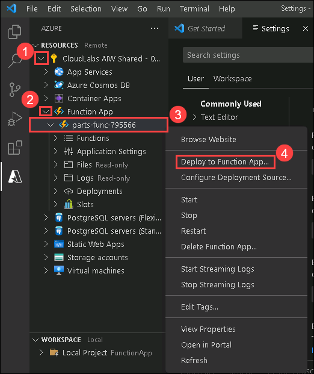

1. Select **Deploy**.

    

## Task 2: Connecting Function App and App Service

1. In the [Azure portal](https://portal.azure.com), navigate to your `parts` Storage Account resource by selecting the **hands-on-lab-<inject key="DeploymentID" enableCopy="false"/>** resource group, and selecting the **parts<inject key="DeploymentID" enableCopy="false"/>** Storage Account from the list of resources.

    

1. Switch to the **Access keys (1)** Blade and select **Show (2)** that is next to the Connection String value. Select the copy button for the first **connection string (3)**. Paste the value into a text editor, such as Notepad.exe, for later reference.

    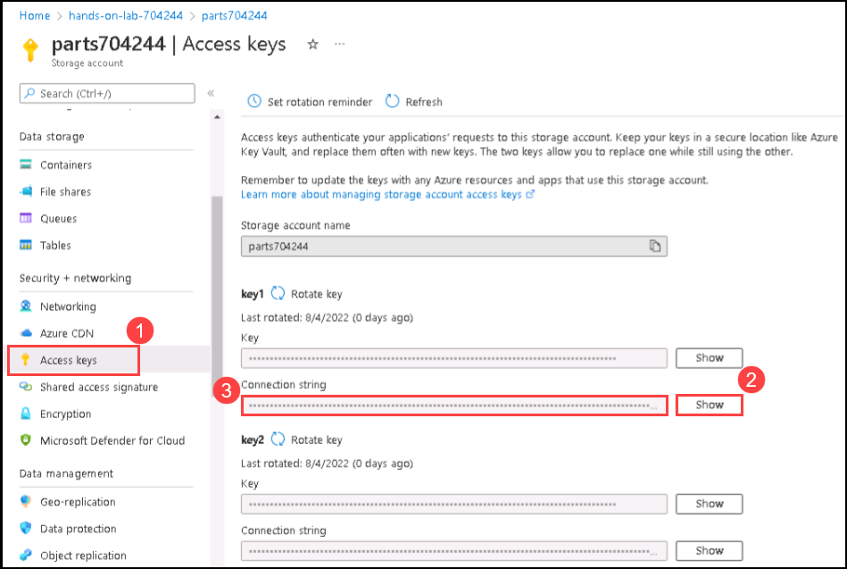

1. Go back to the resource list and navigate to your **(2) partsunlimited-web-<inject key="DeploymentID" enableCopy="false"/>**
App Service resource. You can search for **(1)** `partsunlimited-web` to find your Web App and App Service Plan

   

1. Switch to **Configuration (1)** Blade, and select **+New connection string (2)**.

    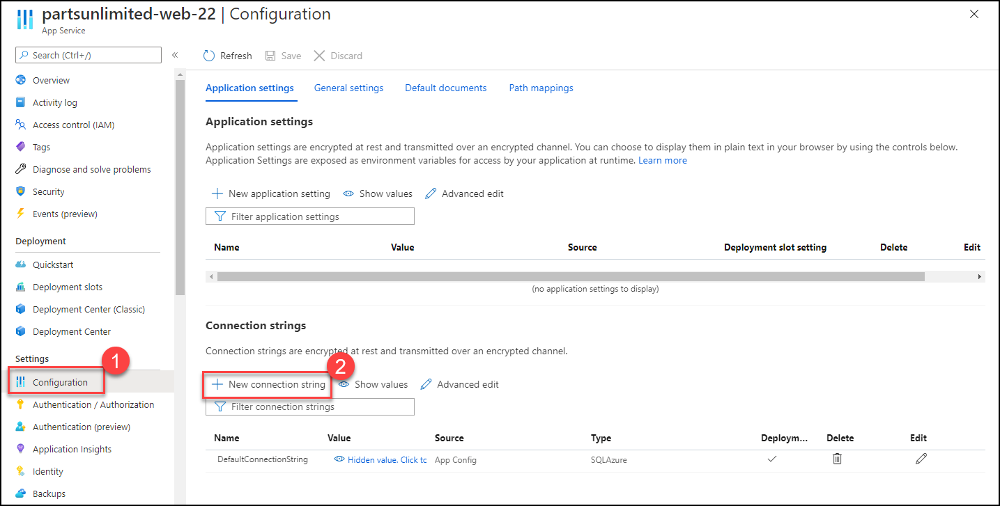

1. On the **Add/Edit connection string** panel, enter the following:

   - **Name (1)**: Enter `StorageConnectionString`
   - **Value**: Enter Storage Connection String you copied in Step 2.
   - **Type (3)**: Select **Custom**
   - **Deployment slot setting (4)**: Check this option to make sure connection strings stick to a deployment slot. This will make sure you can have different settings for staging and production.
   - Select **OK (5)**.

    

1. Select **Save** and **Continue** for the following confirmation dialog.

    

1. Go back to the resource list and navigate to your **parts-func-<inject key="DeploymentID" enableCopy="false"/> (2)** Function App resource. You can search for **`func` (1)** to find your function app.

   

1. Switch to **Configuration (1)** Blade, and select **+New application setting (2)**.

    

1. On the **Add/Edit connection string** panel, enter the following:

    - **Name (1)**: Enter `DefaultConnection`
    - **Value**: Enter SQL Connection String you copied in Exercise 4, Task 6, Step 3.
    - Select **OK (3)**.

    

1. Select **Save** and **Continue** for the following confirmation dialog.

    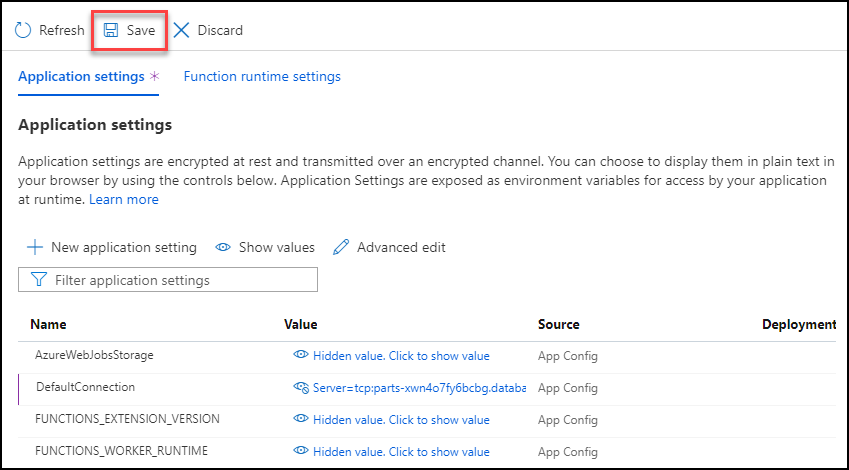

## Task 3: Testing serverless order processing

In this task, we will submit a new order on the Parts Unlimited website and observe the order's processing on the order details page. Once the order is submitted, the web front-end will put a job into an Azure Storage Queue. The Function App that we previously deployed is set to listen to the queue and pull jobs for processing. Once order processing is done, a PDF file will be created, and the link for the PDF file will be accessible on the order details page.

1. Go back to the resource list and navigate to your **partsunlimited-web-<inject key="DeploymentID" enableCopy="false"/> (2)**
App Service resource. You can search for **`partsunlimited-web` (1)** to find your Web App and App Service Plan.

   

1. Select **URL** and navigate to the Parts Unlimited web site hosted in Azure App Service.

    

1. Select **Login (1)**. If a login wasn't created in the earlier exercise, then select **Register as a new user? (2)**, otherwise skip to step 6 (login to the web site)

    

1. Type in `test@test.com` for the email **(1)** and `Password.1!!` **(2)** for the password. Select **Register (3)**.

    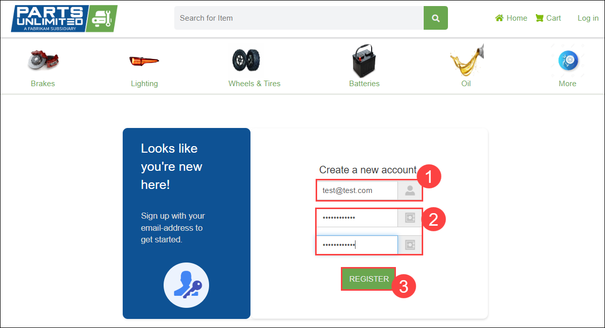

1. On the next screen, select **Click here to confirm your email** to confirm your email.

1. Select **Login (1)**, type the credentials listed below and click the **Login (4)** button.

    - **Email (2):** test@test.com
    - **Password (3):** Password.1!!

    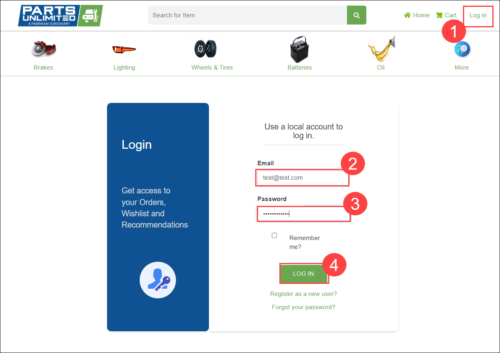

1. Select a product from the home page and select **Add to Cart** once you are on the product detail page.

    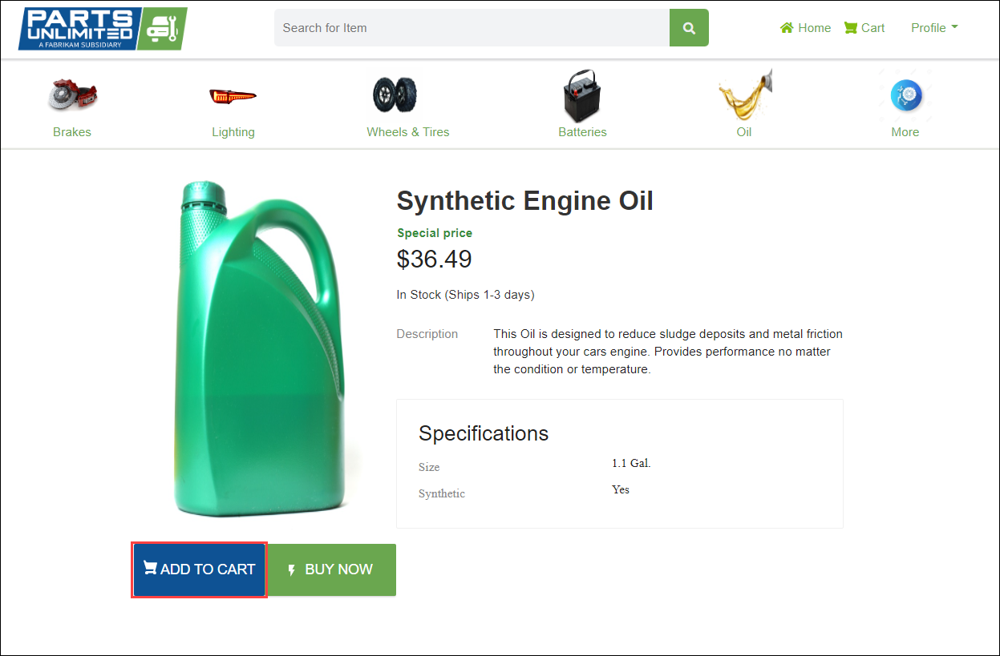

1. Select **Checkout** on the next screen.

1. Fill in sample shipping information **(1)** for testing purposes. Use coupon code **FREE (2)** and select **Submit Order (3)**.

    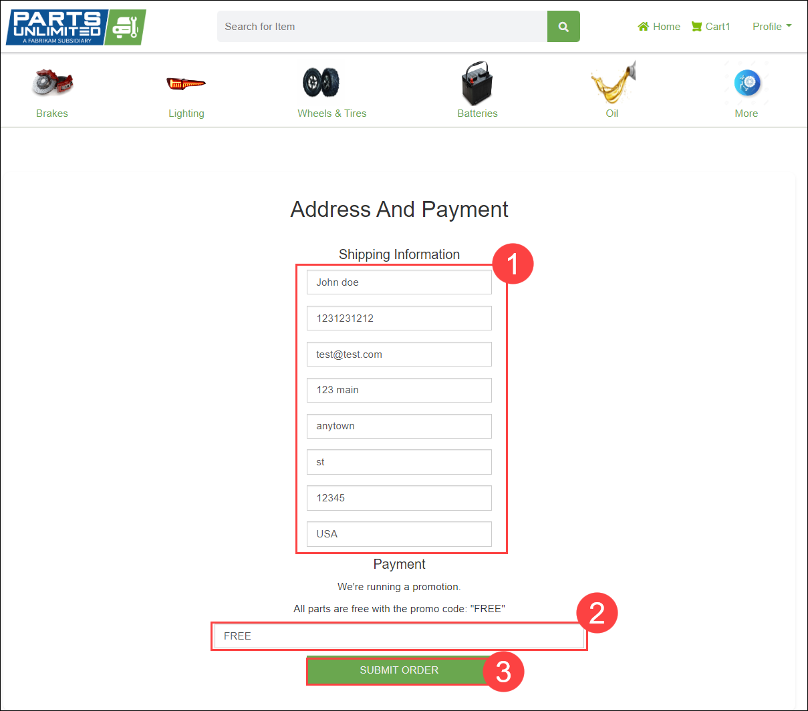

1. Once checkout is complete, select **view your order** to see order details.

    

1. Observe the invoice field. Right now, your order is flagged as in processing. An order job is submitted to the Azure Storage Queue to be processed by Azure Functions. Refresh the page every 15 seconds to see if anything changes about your order.

    

1. Once your order has been processed, an invoice will be created, and a download link will appear. Select the download link to download the PDF invoice created for your order by Azure Functions.

    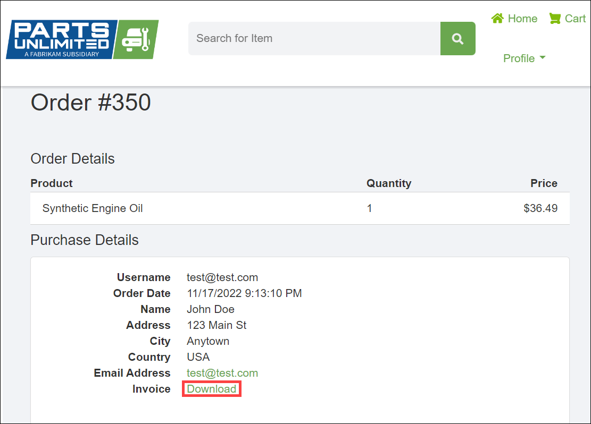

    Here is your invoice.

    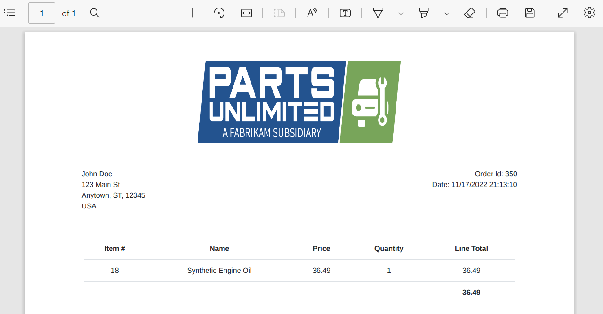

## Task 4: Enable Application Insights on the Function App

In this task, you add Application Insights to your Function App in the Azure Portal, to be able to collect insights related to Function executions.

1. In the [Azure portal](https://portal.azure.com), navigate to your **Function App** by selecting the **hands-on-lab-<inject key="DeploymentID" enableCopy="false"/>**
resource group, and selecting the **parts-func-<inject key="DeploymentID" enableCopy="false"/>** App service from the list of resources.

   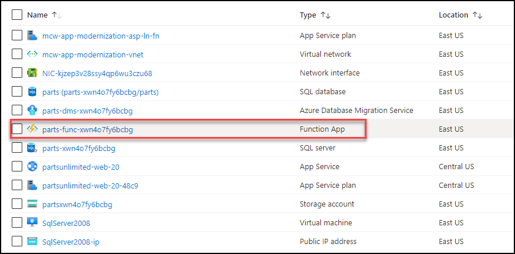

1. On the Function App Blade, select **Application Insights (1)** under Settings from the left-hand menu. On the Application Insights blade, select **Turn on Application Insights (2)**.

   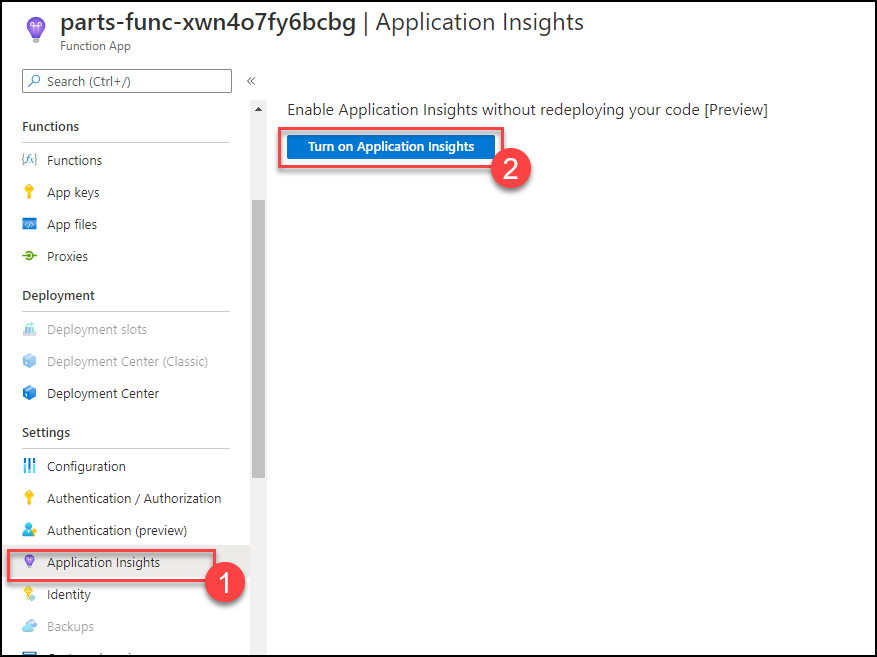

1. On the Application Insights blade, provide the below information.

   - Select **Create new resource (1)**, and accept the default resource name and location provided. 
   - Select existing log analytics workspace **parts-Workspace-<inject key="DeploymentID" enableCopy="false"/>(2)** workspace from the dropdown as shown in the below screenshot.
   - Click on **Apply (3)**, and select **Yes** when prompted about restarting the Function App to apply monitoring settings.

   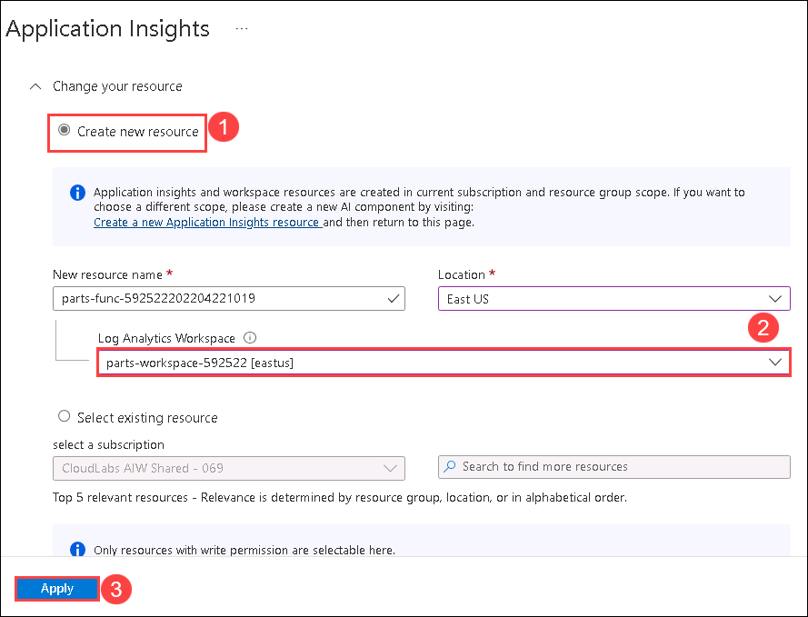

1. After the Function App restarts, select **View Application Insights data**.

   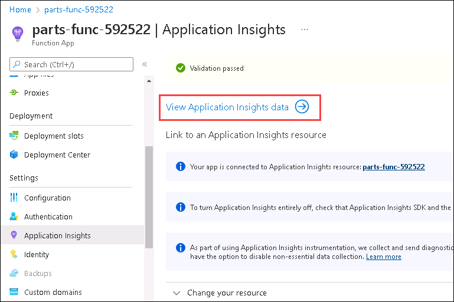

1. On the Application Insights blade, select **Live Metrics (1)** under **Investigate**.

   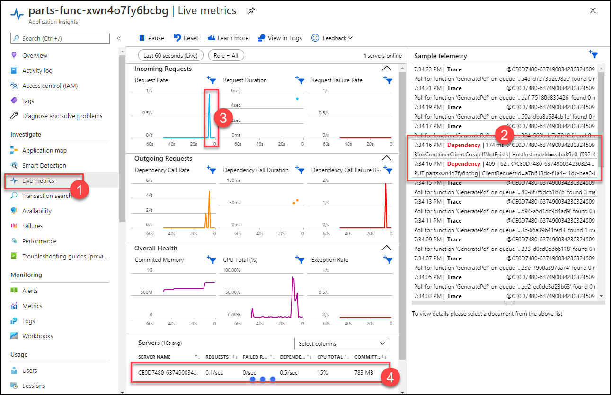

   > It might take a few minutes for the Live Metrics to get loaded. Refresh the Page to view the Live Metrics.
    
   > While having Live Metric up, try submitting a new order on the Parts Unlimited website. You will see access to blob storage in the telemetry to upload the PDF **(2)** and execution count on the graph **(3)**.

## Summary
 
In this exercise you have covered the following:
  
   - Created an Azure Function app. 
   - Connected Azure Function app and App Service. Tested the serverless order processing in the application.
