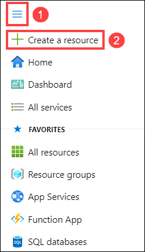
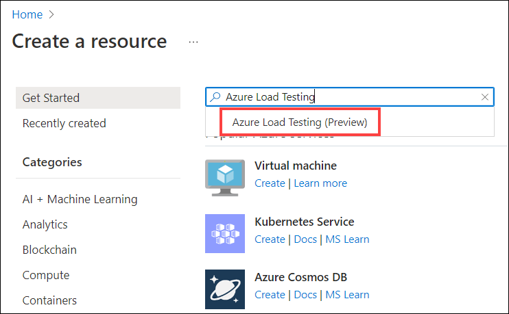
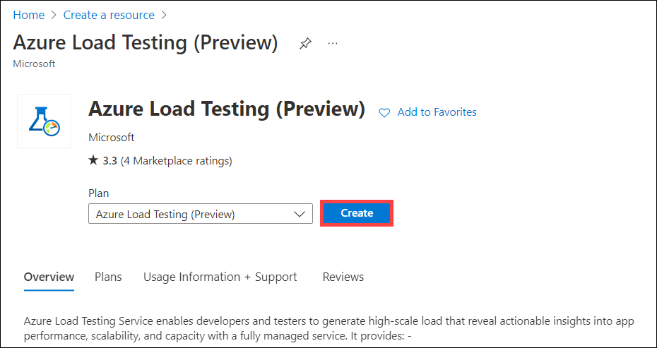
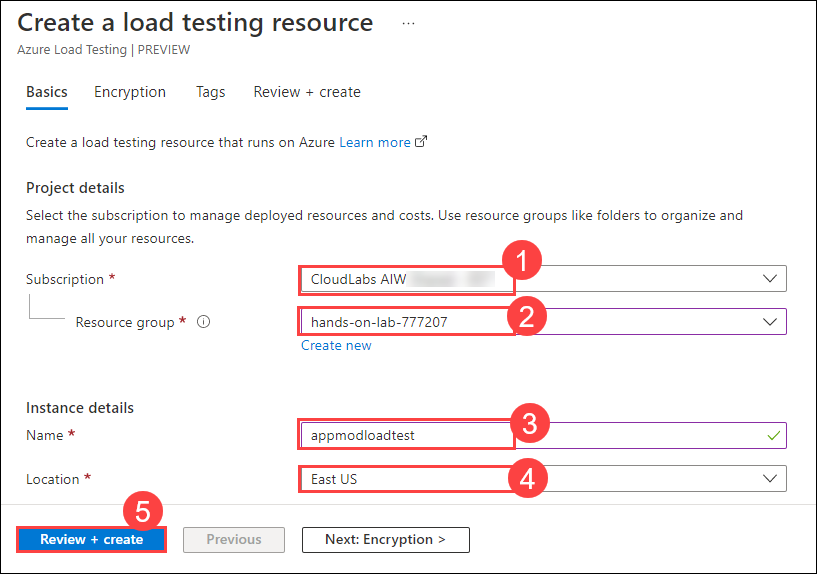
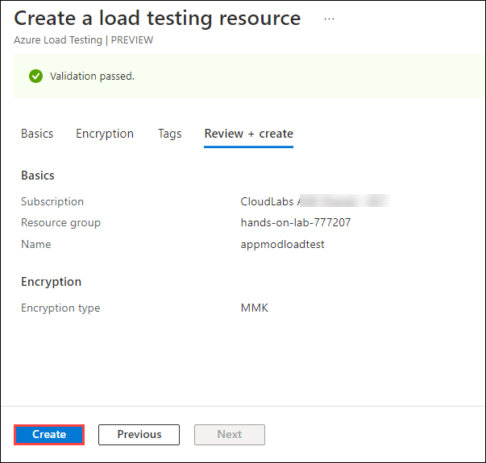
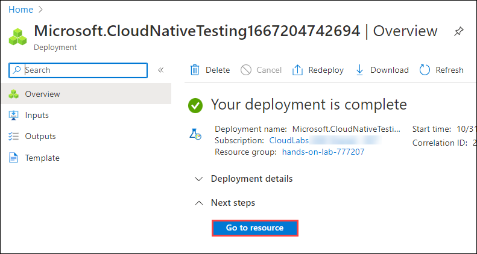
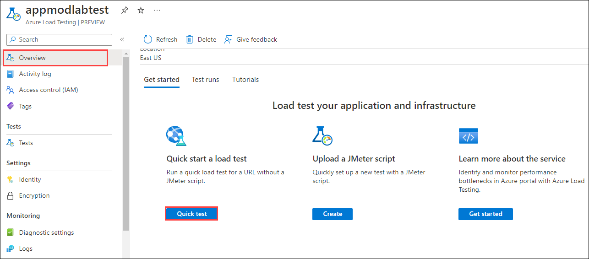
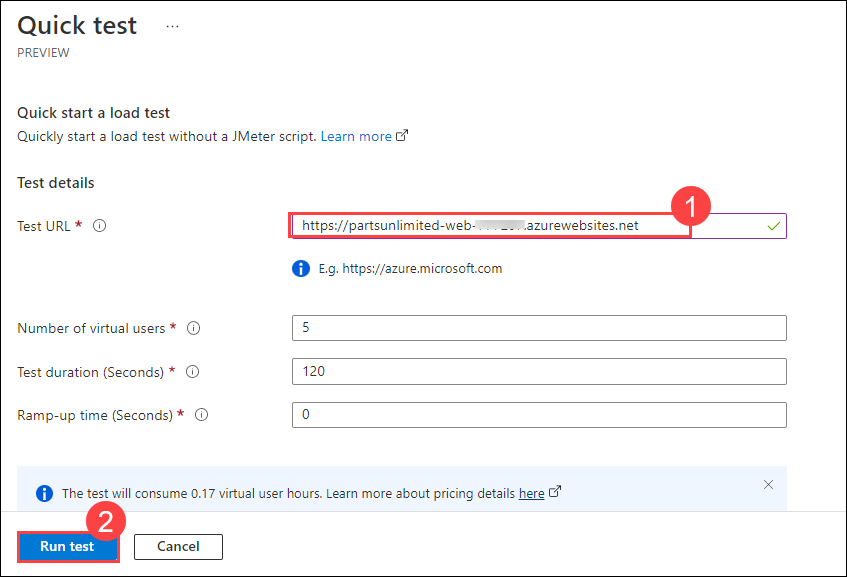
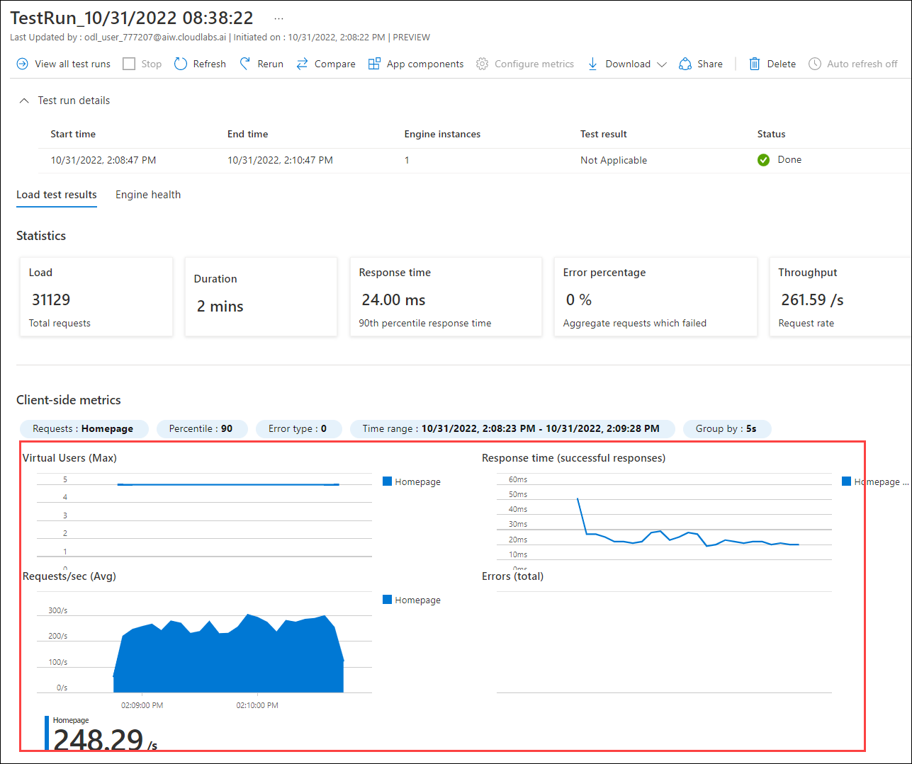

# Exercise 8: Performance testing of web app (Optional)
Duration: 30 minutes

Azure Load Testing Preview is a fully managed load-testing service that enables you to generate high-scale load. Regardless of where your applications are hosted, the service simulates traffic for them. It can be used by programmers, testers, and quality assurance (QA) engineers to enhance the speed, scalability, or capacity of applications.

Azure Load Testing is currently in preview because of which we have limited options available as of now.

In this task, we will see how to load test the parts unlimited web application with Azure Load Testing (Preview) from the Azure portal.

1. Firstly, you will create an Azure Load Testing resource. In the Azure portal, click on **Show portal menu (1)** and select **+Create a resource (2)**.

   

2. Search for Azure Load Testing in the search box and select **Azure Load Testing (Preview)** from the suggestions.
 
   

3. Select **Create** on the Azure Load Testing pane.
 
    

4. Provide the following information to configure the Load test:

   - **Subscription:** Make sure **your subscription (1)** is selected by default.
   - **Resource group:** Select **hands-on-lab-<inject key="DeploymentID" enableCopy="false"/>** **(2)** resource group from the drop-down
   - **Name:** provide **appmodloadtest** as the name for the load test resource **(3)**.
   - **Location:** Leave to default **(4)**.
   - Click on **Review + create (5)**
 
    
    
    
5. Post the validation passes, click on **Create**.

    

6. Click on **Go to resource** to view the resource upon successful deployment.

    

7. Here, you will create a load test by using the web application URL.

8. On the **Overview** page, select **Quick test** given under _Load test your application and infrastructure_.

    

9. On the Quick test page, provide following details:

   - **Test URL:** Enter **https://partsunlimited-web-<inject key="DeploymentID" enableCopy="false"/>.azurewebsites.net** **(1)**
   - Rest of the details are optional. Default values are already updated for all the asks.
   -  Click on **Run test (2)**. This will create and start the load test.

     

10. Once the load test begins, you will be directed to the test run dashboard. Azure Load Testing records both client-side and server-side metrics while the load test is underway. 

11. In the dashboard, you will see the client-side metrics in real-time while the test is running. The data refreshes every five seconds by default.

    
    
## Summary
 
In this exercise you have covered the following:
  
   - Created an Azure Load Testing resource 
   - Tested the parts unlimited web application with Azure Load Testing (Preview) from the Azure portal. 
